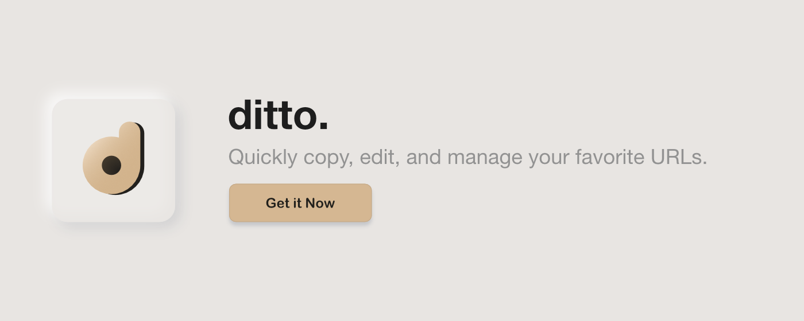

# 

Stay organized and save time with quick access to your most important URLs — all in one clean, sortable list.

Whether you're applying for jobs, doing research, or just managing daily tasks, Ditto helps you keep your key links at your fingertips. No more digging through bookmarks or docs — open your browser, click the icon, and instantly copy or manage any saved link.

## Main features

🔗 One-click copy: Instantly copy any saved URL with a single click.

✏️ Edit & organize: Easily add, rename, and update links to keep your list current.

📋 Sortable list: Drag and drop to reorder your URLs however you like.

🗑️ Delete with ease: Clean up your list in seconds with a simple delete option.

Whether you’re tracking job applications, organizing research sources, or just optimizing your browser workflow, Copy URL Manager is a lightweight extension built for speed, clarity, and control.

## Installation

Find us on the
[Chrome Web Store](https://chromewebstore.google.com/detail/ditto/ppaagdcglnglpajhbhnpgpgcmnikplmn?authuser=3&hl=en)!

## Issues

If you encounter any issues while using the application, please report them [here](https://github.com/tequirk/ditto-extension/issues).

---

Copyright © 2025 Tequirk LLC. All Rights Reserved.
